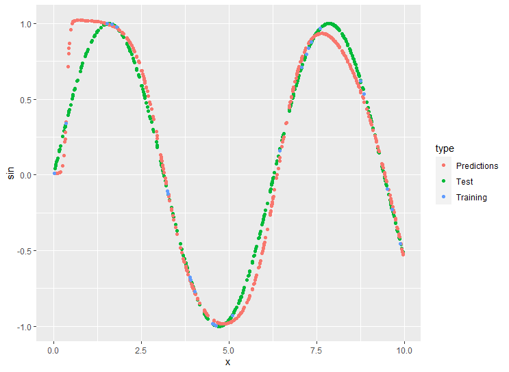
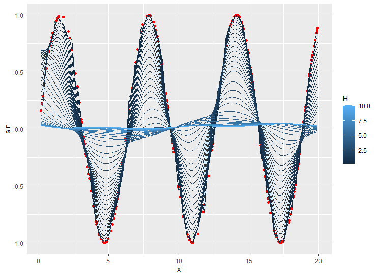
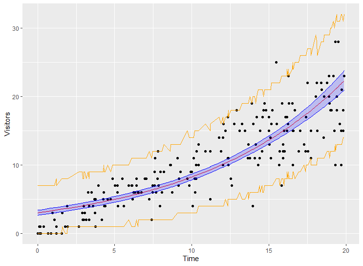
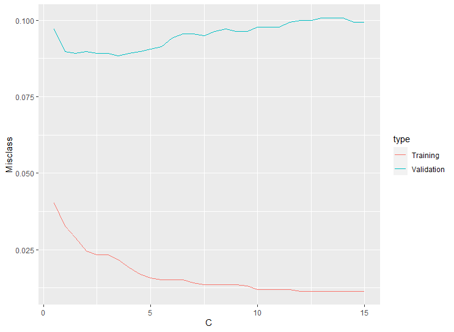
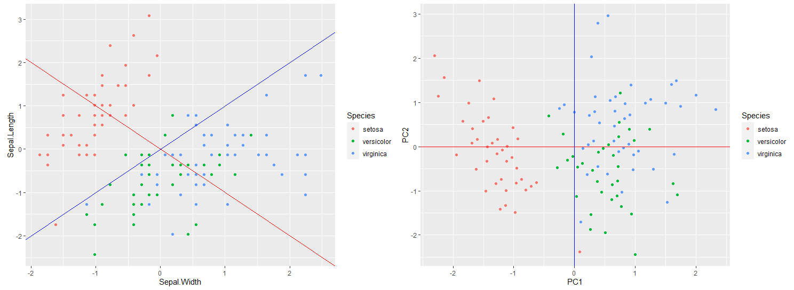
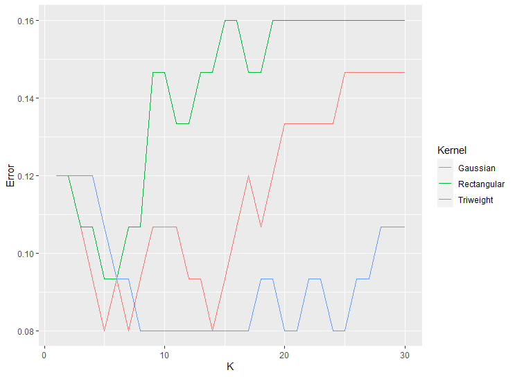
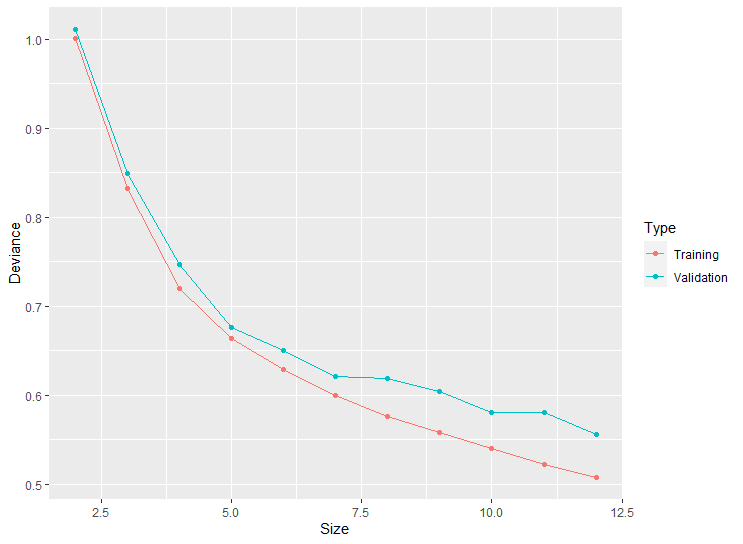
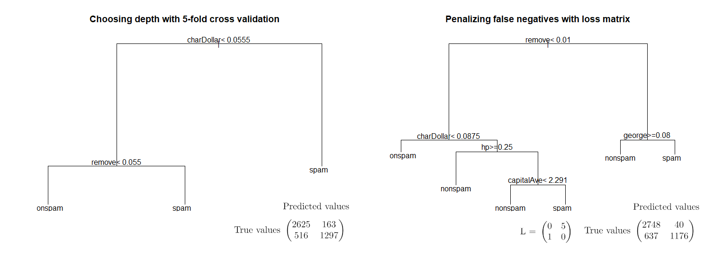

# machine-learning
During the course [TDDE01: Machine Learning](https://liu.se/studieinfo/en/kurs/tdde01/ht-2020), I learned the basics of machine learning in the fall of 2020. In this repo, I wrote some R-code to illustrate a bit of what I learned in the course.

# neuralnet.R: Neural Network Regression

I created a neural network with a single hidden layer with five neurons that predicts sin(x) from x. There is also some code to manually calculate the output of each layer using the sigmoid activation function. The network does not perform that well due to the small size of the training data: only 25 points.

# kernels.R: Kernel Regression

Here I try to predict sin(x) from x using Gaussian kernel regression built from scratch. The plot above visualizes how changing the bandwidth h (making closer 'votes' more important) affects the quality of the predictions. The red dots represent the observations and the lines are the predictions of sin(x) given an x-value for different bandwidths h.

Due to the nature of kernel regression, this code scales extremely poorly. Creating the plot above requires n^2 * h iterations, where n is the number of observations in the data and h is the number of h-values evaluated.  

# boot.R: Parametric Bootstrap

Here I generate some Poisson distributed data and use parametric bootstrap to generate prediction bands and confidence bands, with an alpha of 0.05.

# svm.R: Support Vector Machines

In this file I classify the Hewlett-Packard Labs spam data set using support vector machines with a Gaussian kernel and the width 0.05. First I train the model on training data and make predictions on the validation data for different C-values. Then the optimal C is chosen (here 3.5) and the model is trained on both training and validation data. Finally the generalization error is estimated using the test data set.

As expected, large C values generate a smaller-margin hyperplane that penalized misclassifying the training data harder, risking overfitting. Smaller C-values will generate a large-margin hyperplane and will risk underfitting. Thus it makes sense that the optimal C is at a tradeoff between bias and variance.

# pca.R: Principle Component Analysis

Here I do principle component analysis on the Iris data set, using features Sepal.Width and Sepal.Length to create two new coordinate axis. First implemented from scratch, and then plotted in the new coordinate system using the princomp package.

# knn.R: K-Nearest Neighbor Classification

Here I first separate the Iris data set into training and testing. Then, for three different kernels and K between 1 and 30 I try to predict the test data using the training data. As expected the rectangular kernel does not perform so well.

# tree.R: Decision Tree

In this file I classify the Hewlett-Packard Labs spam data set using a decision tree. First the depth of a tree model from the package tree is chosen by comparing the deviance of trees predicting the validation data for trees with k terminal nodes. Here a complex tree is needed: the deviance of the validation data is the lowest for the tree with the highest number of terminal nodes.

Then I select the optimal size using another method: cross validation. Finally I try using a loss matrix to penalize classifying nonspam as spam.